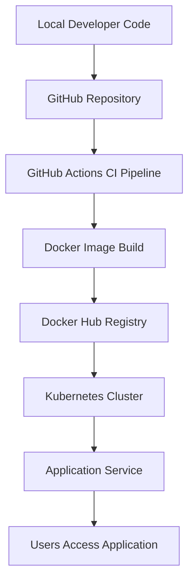

# 🚀 Govind's Cloud-Native DevOps Portfolio

Welcome to my professional repository. I am **Govind**, a **Junior DevOps Engineer** focused on building resilient, automated, and scalable infrastructure. This portfolio showcases my hands-on implementation of CI/CD pipelines, Container Orchestration, and System Automation.

## 🏗️ Master Engineering Architecture


```

🛠️ Specialized Competencies
1. ♾️ CI/CD & Automation (Active Pipelines)
Production-ready automation workflows with integrated GitHub Actions & Green Ticks ✅:

Full-Stack Automation: From commit to K8s deployment.

Multi-Stage Builds: Secure, lightweight Docker images.

Image Lifecycle: Managed release strategies via Docker Hub.

2. ☸️ Kubernetes & Container Orchestration
Architecture: Cluster setup, Pod management, and observability.

Microservices: Network isolation, volume management, and orchestration.

3. 🐧 Infrastructure & System Automation
Linux Administration: Deep dive into system internals and process management.

Scripting: Bash-driven system maintenance and Cron-based scheduling.

🔧 Tools & Technologies
Category	            Tools
Containerization	Docker, Docker Compose, Multi-stage Builds
Orchestration	        Kubernetes (K8s), Minikube, Helm
CI/CD	                GitHub Actions, Workflow Automation
Environment	        Linux (Ubuntu/Debian), VMware, Windows
Scripting	        Bash (Shell Scripting), Python Basics

Junior DevOps Engineer | Govind

Continuous Learning. Continuous Deployment.
